## 🧠 RAG Agent – High-Level Architecture Diagram

```mermaid
flowchart LR

%% =====================================================
%% INDEXING PHASE
%% =====================================================

subgraph Indexing Phase
    A[PDF Document Node.pdf]
    B[PDFLoader]
    C[Text Splitter RecursiveCharacterTextSplitter]
    D[Gemini Embedding Model]
    E[(Pinecone Vector Database)]

    A --> B
    B --> C
    C --> D
    D --> E
end

%% =====================================================
%% QUERY PHASE
%% =====================================================

subgraph Query Phase
    F[User Question CLI]
    G[Query Embedding]
    H[Vector Similarity Search TopK]
    I[Context Builder]
    J[Prompt Template]
    K[Gemini LLM gemini-2.5-flash]
    L[Final Answer]

    F --> G
    G --> H
    H --> I
    I --> J
    J --> K
    K --> L
end

%% =====================================================
%% CROSS CONNECTION
%% =====================================================

E --> H

%% =====================================================
%% STYLING
%% =====================================================

classDef indexing fill:#ede9fe,stroke:#7c3aed,stroke-width:2px,color:#4c1d95;
classDef query fill:#dbeafe,stroke:#2563eb,stroke-width:2px,color:#1e3a8a;
classDef embed fill:#dcfce7,stroke:#16a34a,stroke-width:2px,color:#14532d;
classDef vector fill:#fef3c7,stroke:#f59e0b,stroke-width:2px,color:#78350f;
classDef llm fill:#fee2e2,stroke:#ef4444,stroke-width:2px,color:#7f1d1d;

class A,B,C indexing;
class F,I,J query;
class D,G embed;
class E,H vector;
class K,L llm;
```

### 🔎 Architecture Pattern

This project implements a Retrieval-Augmented Generation (RAG) architecture:

Indexing Phase:
Document → Chunking → Embeddings → Vector Database

Query Phase:
User Question → Query Embedding → Vector Search → Context Injection → LLM → Answer

The system ensures:
- Grounded answers
- Reduced hallucination
- Context-aware generation
- Scalable knowledge retrieval
